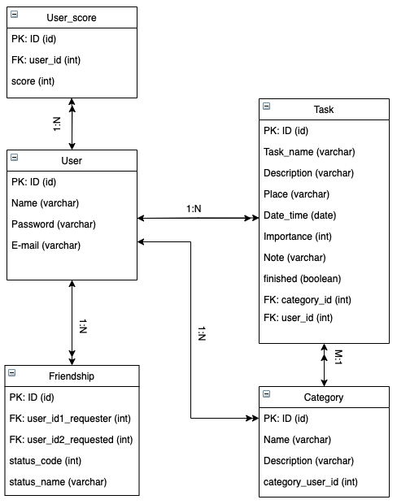

# Home
## Damare, productivity app

## Tým
- Adam Antoš
- Richard Kalousek
- Pavel Kurek
- Lukáš Marek
- Miroslav Šic

## Anotace aplikace
Aplikace Damare je určena pro sebe-organizaci a vylepšení celkové produktivity jedince. Dosahuje toho pomocí zaznamenávání úkolů a žebříčků, které můžete sdílet s přáteli.

## Funkcionalita

### Uživatel #1 - "Chaotik"
- Jako "chaotik" chci zaznamenávat své úkoly, abych je zvládl lépe organizovat.

### Uživatel #2 - "Patrick Bateman - productivity beast"
- Jako "Patrick Bateman" se chci porovnávat s ostatními, abych jim mohl ukazovat, že jsem produktivnější než oni.

### Uživatel #3 - "Zapomínač"
- Jako "zapomínač" si chci nastavovat upozornění, aby mi připomínaly, co musím udělat.

### Uživatel #4 - "Saskia Burešová"
- Jako "Saskia Burešová" chci nastavovat data jednotlivým úkolům, aby se mi zobrazovali v mém kalendáři.

## Návrh aplikace

### Diagram případů užití

1. Hrubý popis
 - Na diagramu můžeme vidět, že uživatel může aplikaci používat 3 případy.
2. Scénáře
 - Setting tasks
 - Completing tasks
 - Competing
3. Detailní popis scénářů
 - Setting tasks - Uživatel může vytvářet úkoly. Těmto úkolů jsem dále nastavit jméno, místo a čas splnění, důležitost, psát k nim další poznámky nebo je řadit do kategorií.
 - Completing tasks - Pokud uživatel úkol dokončí může ho jednoduše označit za splněný.
 - Competing - Uživatel může také soutěžit s jinými uživatele v tom, kdo má více splněných úkolů.

### Diagram tříd

### Databáze
Uživatelé a činnosti, které uložili do aplikace ukládáme do SQL databáze,
 jejíž hosting jsme zajistili pomocí AWS. Konkrétně se tedy jedná o PostgreSQL.
Na obrázku níže je zobrazen konceptuální model databáze.

## Prototyp aplikace

Prototyp aplikace byl vytvořen využitím [Figmy](https://www.figma.com/).
Prototyp jsme navrhovali s částečně proklikávacím wireframem a vizualizačně se jedná o High-fidelity prototyp, tudíž by měl být blízko finální vizualizaci.

Prototyp k dispozici [zde](https://www.figma.com/proto/83W16TIWeS9oYJuCoS66IR/DAMARE?node-id=2%3A980&scaling=min-zoom&page-id=0%3A1&starting-point-node-id=2%3A980&show-proto-sidebar=1)

K testování prototypu zatím nedošlo, nicméně poprosíme samotné čtenáře o zpětnou vazbu.

## Testovací případy

| ID | Název             | Účel                                      | Podmínky                                           | Kroky                                                                                                                                           | Očekávaný výsledek                                                                          |
|----|-------------------|-------------------------------------------|----------------------------------------------------|-------------------------------------------------------------------------------------------------------------------------------------------------|---------------------------------------------------------------------------------------------|
| #1 | Registrace        | Ověření zda se vytvoří účet               | Při registraci byl zadán validní e-mail a heslo    | 1. Zadání registračních údajů 2. Stisknutí tlačítka registrace                                                                                  | 1. Vytvoří se nový účet 2. Uživatel je přihlášen                                            |
| #2 | Login             | Ověření zda proběhne přihlášení           | Při přihlášení byly zadány údaje existujícího účtu | 1. Zadání přihlašovacích údajů 2. Stisknutí tlačítka login                                                                                      | 1. Uživatel je přihlášen 2. Uživatel se nachází na home screen                              |
| #3 | Přidání aktivity  | Ověření zda se vytvoří a uloží aktivita   | Aktivita musí mít název                            | 1. Stisknutí tlačítka + na home screen 2. Vyplnění nutných údajů aktivity 3. Stisknutí tlačítka pod formulářem pro vytvoření a přidání aktivity | 1. Uživatel je zpět na home screen 2. Aktivita byla přidána a je vidět v okně s aktivitami  |
| #4 | Smazání aktivity  | Ověření zda se smaže aktivita             | Ověření zda se smaže aktivita                      | 1. Uživatel rozklikne detail aktivity 2. Stiskne tlačítko smazat 3. Potvrdí smazání aktivity                                                    | 1. Uživatel je zpět na home screen 2. Aktivita byla smazána                                 |
| #5 | Upravení aktivity | Ověření zda se aktivita po uložení upraví | Aktivita musí existovat                            | 1. Uživatel rozklikne detail aktivity 2. Stiskne tlačítko upravit 3. Změní údaj jiný než název 4. Potvrdí změny tlačítkem                       | 1. Uživatel je zpět na home screen 2. Aktivita byla aktualizována                           |

## Projektový board a workflow

 - Pro organizaci využíváme aplikaci [Notion](https://www.notion.so/).
 - Nasadili jsme agilní metodiku zjednodušeného SCRUMu. To pro nás znamená, že jsme na začátek vytvořili backlog, vytvořili jsme skupinu úkolů, jež se rozdělí na menší. Délku sprintů máme nastavenou na 12 dnů. Ve SCRUMu jsou obvyklé 15min. standupy, jež se odehrávají každý den. Standupy, jsme se rozhodli zachovat, ovšem po každých 3 dnech, kdy během sprintu by se měly odehrát 4 pro kontrolu práce. Princip standupu jsme se rozhodli udržet, abychom měli lepší přehled, jak zadaná část ve sprintu vyvyjí.
 
    - Prozatimně organizujeme veškerou spolupráci přes Kanban vytvořený právě v Notionu.
    

 - Pro vývoj aplikace bude využívána větev "dev" a pro její ostré nasazení větev "master". 
